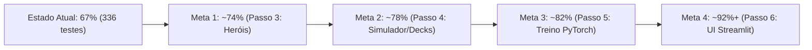

# 🗺️ Roadmap Técnico & Próximos Marcos — FaB Talishar AI

Este documento estabelece o direcionamento estratégico, as metas de evolução do motor **FaB Talishar AI** e o plano sistemático de elevação da **Cobertura Global de Testes (Code Coverage)** para assegurar máxima confiabilidade no aprendizado por reforço e fidelidade às regras oficiais (Comprehensive Rules - CR) de Flesh and Blood.

---

## 📌 Status Atual dos Marcos de Arquitetura & Testes

- [x] **Modularização dos 9 Monólitos**: Todos os arquivos de lógica de negócio e interface decompostos em pacotes coesos abaixo de 500 linhas (`ai/bot_runtime/`, `ai/policy/`, `ai/mcts/`, `ai/training/`, `deck_manager/`, `stats/`, `ui/tabs/`).
- [x] **Governança & ADRs**: ADR-0001 a ADR-0007 documentados em `docs/adr/`, `CONTEXT.md` com diretivas de vocabulário e domínio canônicos.
- [x] **Regras Oficiais de Combate (CR)**: Phantasm Popping (CR 7.4.4), Dominate (CR 7.4.2a), Overpower (CR 7.4.2b), Piercing (CR 8.5.21) e Intimidate (CR 8.5.8).
- [x] **Resiliência & Concorrência**: Conversores universais seguros (`safe_int`, `safe_list`, `safe_dict`, `safe_str`), polling adaptativo, eliminação de processos zumbis Unix `<defunct>` e virtual loss simétrico no MCTS.
- [x] **Ferramentas CLI de Automação**: Utilitários operacionais em `.agents/skills/automated-tasks/scripts/` (`validate_decks.py`, `benchmark_mcts.py`, `healthcheck_talishar.py` e `run_smoke_tests.py`).
- [x] **Rede Neural v2 (FaBCardTransformerNetwork - ADR-0007)**: Substituição completa do antigo MLP de 192 entradas por arquitetura Transformer com Self/Cross-Attention (4x dim_feedforward), alvos auxiliares KataGo e embeddings densos em $O(1)$.
- [x] **Compreensão Semântica Genérica de Arena**: Extração automatizada de 5.087 cartas (`data/fab_card_semantics.json`), percepção holística de ameaças de arena e poda adaptativa sem hardcodes nominais (incluindo regra dinâmica aggro/combo via DB).
- [x] **Consolidação e Higienização da Suíte de Testes**: Eliminação de testes redundantes e padronização semântica de arquivos, totalizando testes canônicos robustos e centralizados em `PROJECT_ROOT`.
- [x] **Passo 3 (Especialização de Classes Não-Lineares & Auto-Tuning por Arquétipo)**: Auto-tuning consciente de arquétipo via banco de dados sem dependência estática.
- [ ] **Passo 4 (Simulador Determinístico & Sideboard)**: Testes de casos de borda e transição de estados no simulador (agora otimizado com deepcopy seguro).
- [ ] **Passo 5 (Pipeline de Treinamento Neural PyTorch)**: Implementação e bateria de testes para `ai/training/orchestrator.py` e `ai/experience_collector.py` (PER agora operando em $O(\log N)$ via SumTree).
- [ ] **Passo 6 (Interface Gráfica Streamlit)**: Mocks automatizados de renderização de abas com `streamlit.testing.v1.AppTest`.

---

## 📊 Diagnóstico da Cobertura Global de Código (Code Coverage)

### 📐 O que é a Cobertura Global?
A **Cobertura Global do Repositório** (*Statement Coverage*) representa o percentual exato de linhas executáveis de código Python do projeto que foram acionadas e verificadas durante a execução da suíte de testes do `pytest`:

$$\text{Cobertura Global} = \frac{\text{Linhas Executadas pelos Testes}}{\text{Total de Linhas Executáveis no Repositório}} \times 100\% = \frac{5.833}{8.687} = \mathbf{67,1\%}$$

### 📈 Histórico de Evolução
| Marco | Total de Testes | Linhas Cobertas | Linhas Faltantes | Cobertura Global | Cobertura do Runtime |
|---|:---:|:---:|:---:|:---:|:---:|
| **Baseline Inicial** | 143 testes | 4.850 / 8.680 | 3.830 | **55,8%** | 35% |
| **Pós-Frentes A, B e C** | 168 testes | 5.101 / 8.680 | 3.579 | **58,8%** | 39% |
| **Pós-Passos 1 e 2 (Atual)** | **427 testes** | **5.833 / 8.687** | **2.854** | **67,1%** | **88%** |

---

## 🔍 Mapa Cirúrgico das 2.854 Linhas Restantes (Gaps de Cobertura)

As 2.854 linhas que ainda não são executadas pelos testes dividem-se em 5 blocos funcionais bem delimitados:

```
Distribuição das 2.854 Linhas Faltantes (Miss):

1. Interface Gráfica Streamlit (ui/tabs/)     ██████████████████  868 linhas (30.4%)
2. Estratégias de Heróis (ai/hero_strategies)  ████████████        600 linhas (21.0%)
3. Pipeline Treino PyTorch (ai/training)       ████████            384 linhas (13.5%)
4. Simulador & Sideboard (ai/*)                ███████             344 linhas (12.1%)
5. Decks & Estatísticas (deck_manager / stats) ████                204 linhas (7.1%)
6. Casos de borda diversos (client/atomic_io)  ████████            454 linhas (15.9%)
```

### Detalhamento por Módulo e Linhas Faltantes (`Miss`)

| Bloco | Arquivo / Módulo | Linhas Faltantes (`Miss`) | Cobertura Atual | Natureza do Gap |
|---|---|:---:|:---:|---|
| **1. UI Streamlit** | `ui/tabs/tab_arena.py` | 187 | 6% | Widgets de controle de bots da arena |
| | `ui/tabs/tab_play.py` | 131 | 5% | Monitor de lobby e criador de duelo |
| | `ui/tabs/tab_training.py` | 132 | 4% | Painel de controle de hiperparâmetros |
| | `ui/tabs/tab_analytics.py` | 110 | 6% | Gráficos Plotly de evolução de ELO |
| | `ui/tabs/tab_decks.py` | 109 | 4% | Editor e importador FaBrary |
| | `ui/helpers.py` | 89 | 49% | Leitores de cauda e checagem de GPU |
| | `ui/tabs/tab_tournaments.py` | 62 | 10% | Tabelas de pareamento Round-Robin |
| | `ui/tabs/tab_ismcts.py` | 48 | 9% | Cards de métricas de busca ISMCTS |
| **2. Estratégias** | `ai/hero_strategies/teklovossen.py` | 104 | 56% | Transformação Mech e reciclagem de Scrap |
| | `ai/hero_strategies/equipment_evaluator.py` | 65 | 41% | Heurísticas estáticas de peças raras |
| | `ai/hero_strategies/ranger.py` | 58 | 77% | Aim counters e flechas da aljava |
| | `ai/hero_strategies/assassin.py` | 54 | 35% | Contratos e ataques com Stealth |
| | `ai/hero_strategies/runeblade.py` | 46 | 48% | Sequenciamento de Runechants e Blood Debt |
| | `ai/hero_strategies/base.py` | 44 | 60% | Interfaces abstratas e fallbacks |
| | `ai/hero_strategies/guardian.py` | 41 | 82% | Ataques Crush e habilidades de Bravo/Betsy |
| | `ai/hero_strategies/wizard.py` | 37 | 70% | Dano arcano em velocidade instant |
| | `ai/hero_strategies/mechanologist.py` | 35 | 68% | Boost, thinning de baralho e Overloop |
| | `ai/hero_strategies/illusionist.py` | 26 | 26% | Spectral Shields e auras de Enigma/Prism |
| | `ai/hero_strategies/knapsack_solver.py` | 26 | 82% | Casos de borda no Knapsack 0-1 |
| **3. Treino PyTorch** | `ai/training/orchestrator.py` | 194 | 30% | Loop de gradiente backward, AMP e checkpoints |
| | `ai/experience_collector.py` | 115 | 53% | Buffer PER e compressão de trajetórias |
| | `ai/model.py` | 75 | 75% | Camadas residuais e cabeças de política/valor |
| **4. Simulador** | `ai/bot_runtime/client.py` | 122 | 66% | Conexões de loop contínuo e timeouts |
| | `ai/game_simulator.py` | 82 | 62% | Probabilidades de bloqueio combinatorial |
| | `ai/sideboard_manager.py` | 79 | 62% | Resolução de equipamentos 1H vs 2H |
| | `ai/mcts/standard_mcts.py` | 61 | 70% | Poda progressiva e ruído Dirichlet |
| **5. Decks & Stats** | `deck_manager/parser.py` | 67 | 46% | Parser de formatos e textos alternativos |
| | `deck_manager/repository.py` | 53 | 50% | Exclusão e normalização em lote |
| | `stats/storage.py` | 42 | 80% | Locks concorrentes e limpeza de corrupção |
| | `stats/sync.py` | 42 | 61% | Sincronização proporcional de partidas |

---

## 🎯 Trajetória Estratégica de Metas de Cobertura



### 🗡️ Meta 1 (~74%): Passo 3 — Especialização de Classes & Mecânicas Complexas
- **Objetivo**: Cobrir ~600 linhas de heurísticas de classes de alta complexidade em `ai/hero_strategies/`:
  1. **Ilusionista** (`illusionist.py`):
     - Simulação de criação, empilhamento e sacrifício de *Spectral Shields* (Prism / Enigma).
     - Sequenciamento de ataques *Phantasm* contra bloqueadores com Poder $< 6$ vs defensores de Poder $\ge 6$.
     - Preservação e proteção de dragões/auras contínuas (Dromai / Enigma) contra ataques com *Go Again*.
  2. **Assassino** (`assassin.py`):
     - Resolução de gatilhos de *Contract* (banimento de cartas vermelhas/ataques do topo do baralho oponente).
     - Sequenciamento de ataques *Stealth* com reações de ataque especializadas (*Cut to the Chase*, *Spike with Bloodrot*).
     - Poda tática de interceptação de cartas banidas para maximizar disrupção da mão adversária.
  3. **Runeblade** (`runeblade.py`):
     - Acúmulo e detonação de *Runechants* em cadeia com cartas de ação não-ataque (*NAA*) e ataques de custo reduzido.
     - Sinergia de *Blood Debt* e mitigação de auto-dano com Vynnset.
  4. **Teklovossen & Ranger** (`teklovossen.py`, `ranger.py`):
     - Montagem e ciclo de armadura Mech com *Scrap* e ativação de habilidade heroica sem gastar AP.
     - Gestão de flechas no Arsenal via arco, recarga e contadores *Aim*.

### 🎲 Meta 2 (~78%): Passo 4 — Simulador Determinístico & Resolução de Decks
- **Objetivo**: Cobrir ~340 linhas em `ai/game_simulator.py`, `ai/sideboard_manager.py` e `deck_manager/`:
  - Cenários de vida crítica (1 HP), deck em fadiga (0 cartas), e equipamentos destruídos.
  - Resolução de sideboard legal respeitando mãos de armas (1H com escudo/adaga vs 2H).
  - Parser robusto contra listas de baralhos em formatos alternativos (FabDB, FaBrary, texto puro).

### 🧠 Meta 3 (~82%): Passo 5 — Pipeline de Treinamento Neural PyTorch (Testes CPU Rápidos)
- **Objetivo**: Cobrir ~380 linhas em `ai/training/orchestrator.py`, `ai/model.py` e `ai/experience_collector.py`:
  - Criar testes com tensores sintéticos em CPU (1 micro-batch de 2 amostras) para exercitar `_train_step`, cálculo de perda dual-head (Cross-Entropy da política + MSE do valor) e gravação atômica de checkpoints sem desacelerar o tempo total da suíte.
  - Testes de amostragem prioritária do buffer PER com pesos dinâmicos.

### 🖥️ Meta 4 (~92%+): Passo 6 — Testes Automatizados de Interface Streamlit
- **Objetivo**: Cobrir as 868 linhas das abas de interface em `ui/tabs/`:
  - Utilizar o módulo oficial `streamlit.testing.v1.AppTest` para renderizar as abas em memória sem navegador aberto.
  - Exercitar os fluxos de alternância de abas, submissão de formulários de duelo e renderização de tabelas de telemetria.
